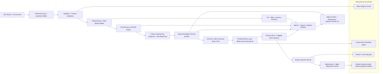

# AI Controller — Predictive Maintenance Platform

A real-time predictive maintenance platform for large-scale ASIC miner fleets. This system ingests telemetry via CSV upload or live API polling, computes health KPIs, detects anomalies, predicts failures before they happen, and delivers prioritized alerts through a live dashboard, email, and Telegram.

## Application Architecture

The system utilizes a modular, microservice architecture designed to handle thousands of miners running concurrently:



```text
┌─────────────────────────────────────────────────────────────────┐
│                      docker compose up                          │
│                                                                 │
│  ┌────────────┐   ┌────────────────────────────────────────┐    │
│  │ TimescaleDB│◀──│           FastAPI (api service)        │    │
│  │ (postgres) │   │  • Auth (JWT)                          │    │
│  │            │   │  • CSV upload / API polling endpoint   │    │
│  │  Tables:   │   │  • KPI / analytics queries             │    │
│  │  telemetry │   │  • Predictions read/write              │    │
│  │  alerts    │   │  • Serves dashboard static files       │    │
│  └────────────┘   └────────────────────────────────────────┘    │
│        ▲                              ▼                         │
│  ┌────────────┐   ┌────────────────────────────────────────┐    │
│  │  Worker    │   │       Browser → Dashboard              │    │
│  │  (APSched) │   │  • Fleet grid (live risk heatmap)      │    │
│  │  • KPI     │   │  • Analytics (correlations/trade-offs) │    │
│  │  • ML infer│   │  • Miner detail + time-series charts   │    │
│  │  • Retrain │   │  • Alert center & System Settings      │    │
│  │  • Telegram│   │                                        │    │
│  └────────────┘   └────────────────────────────────────────┘    │
└─────────────────────────────────────────────────────────────────┘
```

## Deploy From GitHub

This is the production deployment path from a clean machine.
For environment-specific runbooks (local/staging/production), reverse proxy/TLS, and backup/restore, see `docs/DEPLOYMENT.md`.
For prioritized implementation work to reach production maturity, see `docs/PRODUCTION_BACKLOG.md`.
For detailed model build and validation steps, see `docs/model-generation.md`.

### Prerequisites
- Git
- Docker Desktop (Windows/macOS) or Docker Engine + Docker Compose v2 plugin (Linux)
- At least 4 vCPU and 8 GB RAM recommended for local production-like runs
- Optional for offline model build: Python 3.11+

### 1) Clone the repository

```bash
git clone https://github.com/jbsaenz/aicontroller.git
cd aicontroller
```

SSH alternative:

```bash
git clone git@github.com:jbsaenz/aicontroller.git
cd aicontroller
```

### 2) Configure environment

macOS/Linux:

```bash
cp .env.example .env
```

Windows PowerShell:

```powershell
Copy-Item .env.example .env
```

Minimum production variables to change before go-live:
- `POSTGRES_PASSWORD`
- `JWT_SECRET`
- `APP_SETTINGS_ENCRYPTION_KEY`
- `ADMIN_USERNAME`
- `ADMIN_PASSWORD_HASH` (bcrypt hash)
- `ALLOWED_ORIGINS`
- `AUTH_LOGIN_RATE_LIMIT` (for brute-force protection)
- `AUTH_COOKIE_SECURE` (`true` in production TLS deployments)
- `API_SOURCE_ALLOWLIST` (required for external source polling; empty disables outbound sources)

Generate a bcrypt hash for `ADMIN_PASSWORD_HASH`:

```bash
python3 - <<'PY'
from passlib.context import CryptContext
pwd = CryptContext(schemes=["bcrypt"], deprecated="auto")
print(pwd.hash("replace-with-strong-password"))
PY
```

Useful ingestion guardrails:
- `MAX_INGEST_FILE_BYTES` (default `10485760`)
- `MAX_INGEST_ROWS` (default `200000`)

### 3) (Recommended) Build the model artifact before first start
Without a model artifact, worker inference falls back to heuristic scoring.
Full model build runbook: `docs/model-generation.md`.

macOS/Linux:

```bash
python3 -m venv .venv
source .venv/bin/activate
pip install --upgrade pip
pip install -r requirements.txt
python src/pipeline.py --phase phase2-5
```

Windows PowerShell:

```powershell
python -m venv .venv
.\.venv\Scripts\Activate.ps1
python -m pip install --upgrade pip
pip install -r requirements.txt
python .\src\pipeline.py --phase phase2-5
```

Expected artifact path:
- `outputs/models/phase4_best_model.joblib`

### 4) Start the full stack

```bash
docker compose up -d --build
```

The stack runs:
- TimescaleDB (`db`)
- FastAPI + dashboard (`api`)
- APScheduler worker (`worker`)

Services bind-mount `./outputs` into containers at `/app/outputs` so reports/model artifacts are shared.

### 5) One-time migrations for existing databases only
Skip this on a brand-new database volume.

```bash
docker compose exec -T db psql -U aicontroller -d aicontroller < scripts/apply_analytics_rollup.sql
docker compose exec -T db psql -U aicontroller -d aicontroller < scripts/apply_runtime_safety_settings.sql
docker compose exec -T db psql -U aicontroller -d aicontroller < scripts/apply_policy_economics_tuning.sql
```

If upgrading a legacy deployment with duplicate `(miner_id, timestamp)` rows, run:

```bash
docker compose exec -T db psql -U aicontroller -d aicontroller < scripts/apply_dedup_indexes.sql
```

`scripts/apply_dedup_indexes.sql` performs `DELETE` operations on telemetry hypertables and should be run in a maintenance window after taking a database backup.

### 6) Smoke-test the deployment

macOS/Linux:

```bash
docker compose ps
curl -s http://localhost:8080/api/health
```

Windows PowerShell:

```powershell
docker compose ps
Invoke-RestMethod -Uri http://localhost:8080/api/health
```

Expected health response:

```json
{"status":"ok","service":"aicontroller-api","version":"1.0.0"}
```

### 7) Access the dashboard
Open **http://localhost:8080** and sign in with the default credentials:

| Field | Value |
|-------|-------|
| Username | `admin` |
| Password | `admin` |

> ⚠️ **Change these credentials before any production deployment.** Update `ADMIN_USERNAME` and `ADMIN_PASSWORD_HASH` in your `.env` file. Generate a new bcrypt hash with:
> ```bash
> python3 -c "import bcrypt; print(bcrypt.hashpw(b'your-strong-password', bcrypt.gensalt()).decode())"
> ```
>
> ⚠️ **Docker Compose note for bcrypt hashes:** bcrypt strings contain `$` characters. The default value in `.env.example` is already escaped for Compose. If you generate a custom hash, escape each `$` as `$$` in `.env` (example: `$2b$12$...` -> `$$2b$$12$$...`).

### 8) Optional: load synthetic telemetry (recommended on first run)
On a fresh database, the dashboard can be empty after login. This is expected until telemetry is ingested and worker jobs process it.
Before running this step, ensure `docker compose up -d --build` is already running.

Fastest option for first-time users:
- In the Fleet page empty state, click **Load Sample Data**. This calls `POST /api/ingest/seed-demo` and immediately seeds telemetry + KPI + risk rows.

Technical/CLI option:
- Run the fleet generator from shell:

macOS/Linux:

```bash
export E2E_ADMIN_USERNAME=admin
export E2E_ADMIN_PASSWORD=admin
python3 generate_large_fleet.py
```

Windows PowerShell:

```powershell
$env:E2E_ADMIN_USERNAME = "admin"
$env:E2E_ADMIN_PASSWORD = "admin"
python .\generate_large_fleet.py
```

This uploads synthetic telemetry for approximately 1,000 miners.

### 9) Updating to a new GitHub revision

```bash
git pull
docker compose up -d --build
```

### 10) Common startup issues
- `api` or `worker` exits immediately: run `docker compose logs api worker --tail=200`.
- Health endpoint not ready: verify DB is healthy with `docker compose ps` and wait for `db` status `healthy`.
- Login fails with `admin` / `admin`: verify `ADMIN_USERNAME` and `ADMIN_PASSWORD_HASH` in `.env`, then rebuild with `docker compose up -d --build`.
- Dashboard is empty after successful login: this is expected on fresh installs; use Fleet page **Load Sample Data** (recommended) or seed via Section 8 CLI commands.
- No ML inference alerts: confirm model exists at `outputs/models/phase4_best_model.joblib`.
- External source rejected: confirm host is in `API_SOURCE_ALLOWLIST` and not private/link-local/metadata space.

---

## Technical Details

### API Services (`/api`)
- **FastAPI Core**: Complete routing matrix for `ingest`, `fleet`, `miners`, `analytics`, `alerts`, and `settings`. Includes JWT middleware.
- **First-run onboarding endpoint**: `POST /api/ingest/seed-demo` seeds telemetry + KPI + risk rows for immediate dashboard visibility on fresh installs.
- **Analytics Module**: Advanced correlation and tradeoff matrixes with dynamic historical filtering supporting precise `start_time` and `end_time` capabilities.
- **Async DB Layer**: `SQLAlchemy` async session pooling mapping to `TimescaleDB` hypertables to maintain massive high-frequency series entries effectively.

### Worker Node (`/worker`)
- Background polling loop controlled by `APScheduler`.
- **`fetcher.py`**: Executes configurable REST polling against external IP ranges (e.g. CGI API on Antminers). Capable of reading deep hardware metrics including chip anomalies (`chip_temp_max`, `chip_temp_std`) and hardware faults (`bad_hash_count`, `read_errors`).
- External source polling is restricted to allowlisted hosts and blocks private/link-local/metadata address spaces.
- Fetcher now drops malformed source rows (missing `miner_id` or invalid `timestamp`) instead of inserting synthetic placeholders.
- **`ml_jobs.py`**: Calculates the *True Efficiency (TE)* KPI formulas on incoming streams. Executes inference runs, banding miners into low, medium, or high risk queues, dynamically creating alerts. Contains heuristic backups for when active models are dropped.
- Inference uses a configurable historical lookback window (`INFERENCE_LOOKBACK_HOURS`) to rebuild temporal features at serving time, reducing training-serving feature skew.
- Alert actioning uses an economics-aware policy optimizer with energy price and curtailment inputs, then runs a baseline-vs-optimized backtest before allowing automated actions.
- **`automator.py`**: The Action Policy Engine. In production-safe default (`CONTROL_MODE=advisory`) it is disabled; set `CONTROL_MODE=actuation` to allow command execution with external acknowledgement. Set `AUTOMATOR_ENDPOINT_ALLOWLIST` to trusted actuation hosts before enabling production command dispatch. Runtime mode is read from `app_settings.control_mode` (env fallback), so operational mode flips can be applied without container restart.
- **`notifier.py`**: Dedicated task that sweeps pending database alerts and safely shoots emails (SMTP) and Telegram messages without hitting rate limits.

Policy/economics runtime settings:
- `control_mode` (`advisory` or `actuation`)
- `inference_lookback_hours`
- `cooling_power_ratio`
- `policy_optimizer_enabled`
- `automation_require_policy_backtest`
- `policy_min_uplift_usd_per_miner`
- `energy_price_usd_per_kwh`
- `hashprice_usd_per_ph_day`
- `opex_usd_per_mwh`
- `capex_usd_per_mwh`
- `energy_price_schedule_json`
- `curtailment_windows_json`
- `risk_probability_horizon_hours`

Economics model follows the mining-margin framing:
- revenue from hashprice and efficiency
- all-in cost from energy + O&M + capex amortization
- margin-aware action utility with risk-adjusted failure cost
- default economics profile: `curtailment_penalty_multiplier=2.0`, `policy_reward_per_th_hour_usd=0.0022916667` (derived from `hashprice_usd_per_ph_day=55`), `policy_failure_cost_usd=300`
- for existing databases, apply `scripts/apply_policy_economics_tuning.sql` to update only legacy defaults while preserving custom overrides

Policy backtest report output:
- `/app/outputs/metrics/policy_backtest_latest.json` (inside containers)

### UI Component (`/dashboard`)
- Full HTML/JS/CSS dynamic SPA (Single Page Application).
- Contains real-time correlation heatmaps plotting relationships between ASIC voltage, clock frequency, temperature, power, and efficiency over selectable intervals (24h, 7 Days, 30 Days).
- Granular line plots detailing rolling series data when investigating problematic, single miners.

---

## Offline Analytics Pipeline (Research & Modeling)

If you are performing purely analytical or data-science research workflows generating synthetic models outside the live system, utilize the `src/pipeline.py` standalone tool. 
For runtime-oriented model build/validation and artifact usage, see `docs/model-generation.md`.

*Requirements: Ensure you are running within a `.venv` utilizing the `requirements.txt`.*

```bash
# Run Synthetic Data Generation & Preprocessing
python src/pipeline.py --phase phase2

# Run EDA, TE KPI generation, anomaly scanning
python src/pipeline.py --phase phase3

# Run Feature Engineering + Baseline Modelling
python src/pipeline.py --phase phase4

# Evaluate packaging and plot threshold analysis figures
python src/pipeline.py --phase phase5

# Run end-to-end pipeline in one sweep
python src/pipeline.py --phase phase2-5
```

Research components output to `--data/` (raw logs) and `--outputs/` (figures, json metrics, serialized artifacts). 
